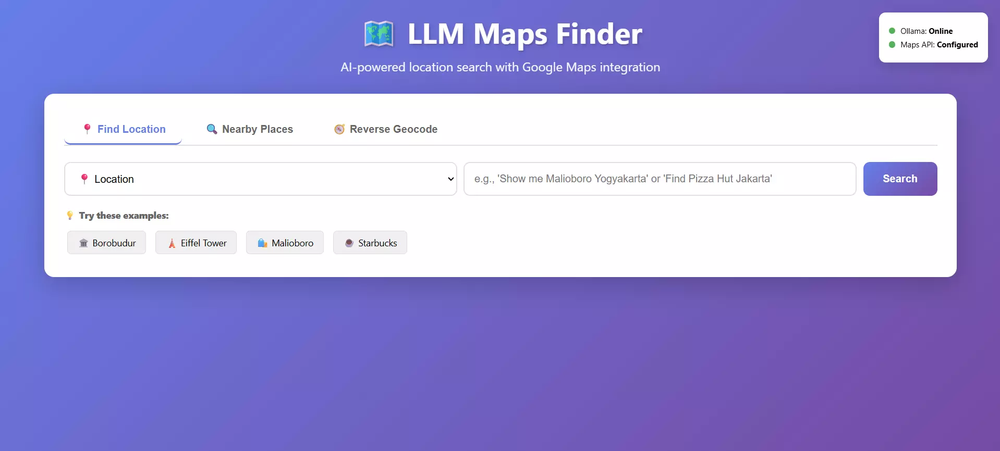
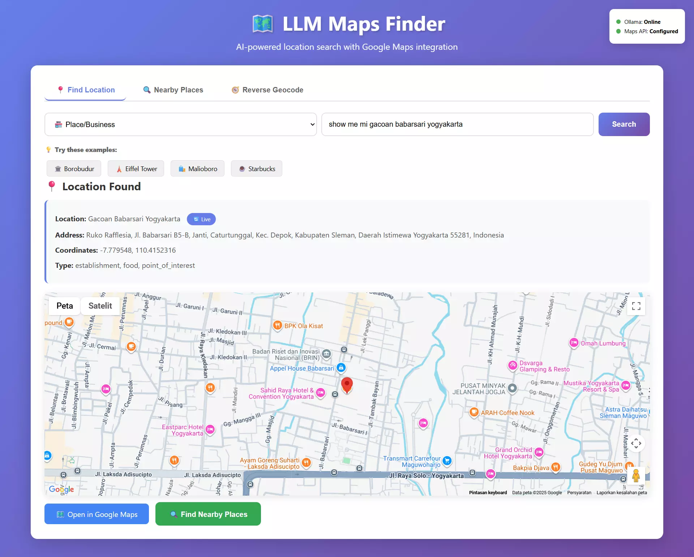
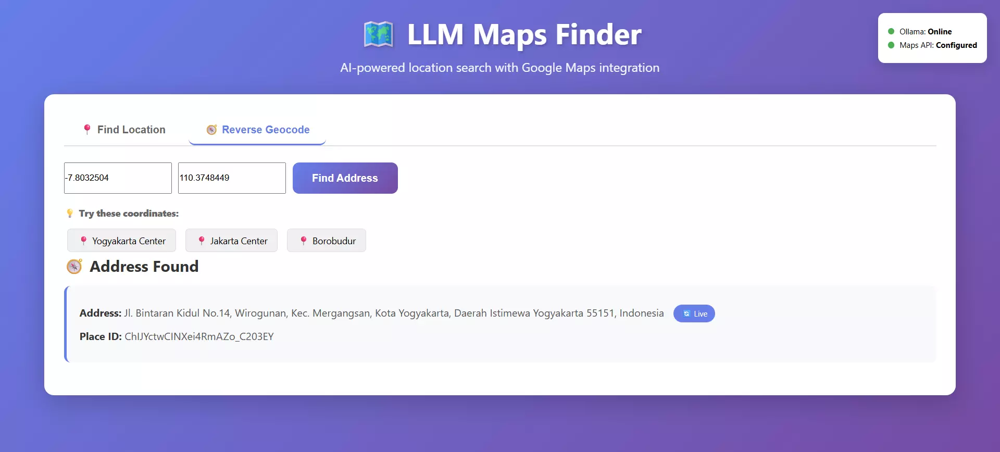

# LLM Google Maps Integration

Technical test submission for HeyPico.ai

## Screenshots

### Main Interface


### Location Search Result


### Reverse Geocoding


## Overview

This project demonstrates integration between a local Large Language Model (Ollama with Llama 3.1) and Google Maps API to create an intelligent location search application. Users can input natural language queries, and the LLM extracts location information to display interactive maps.

## Features

### ✅ Core Features
- **Natural Language Processing** - Local LLM (Llama 3.1 via Ollama) processes user queries
- **Location Search** - Extract and geocode locations from natural language
- **Interactive Maps** - Embedded Google Maps with markers and controls
- **Reverse Geocoding** - Convert coordinates to human-readable addresses
- **Multiple Query Types** - Support for locations, places, streets, and buildings
- **Direct Links** - Quick access to open locations in Google Maps

### 🚀 Advanced Features
- **Rate Limiting** - 200 requests/day, 50/hour per user
- **Response Caching** - 1-hour cache for location queries, 2-hour for geocoding
- **Performance Tracking** - Server-side execution time monitoring
- **Health Monitoring** - Real-time status of Ollama and Google Maps API
- **Error Handling** - Comprehensive error messages and fallbacks
- **Security** - API keys in environment variables, CORS configured

## Tech Stack

**Backend:**
- Python 3.8+ with Flask
- Flask-CORS for cross-origin requests
- Flask-Limiter for rate limiting
- Flask-Caching for response caching
- Requests library for API calls

**LLM:**
- Ollama (Local LLM runtime)
- Llama 3.1 model

**APIs:**
- Google Maps Geocoding API
- Google Maps JavaScript API

**Frontend:**
- Vanilla HTML5/CSS3/JavaScript
- Responsive design with CSS animations
- Tab-based interface

## Architecture
```
┌─────────────┐      ┌──────────────┐      ┌─────────────────┐
│   Browser   │─────▶│ Flask Server │─────▶│     Ollama      │
│  (Frontend) │      │  (Backend)   │      │  (Llama 3.1)    │
└─────────────┘      └──────┬───────┘      └─────────────────┘
                            │
                            ▼
                   ┌─────────────────┐
                   │  Google Maps    │
                   │      API        │
                   └─────────────────┘
```

## Setup Instructions

### Prerequisites
- Python 3.8 or higher
- Ollama installed ([Download here](https://ollama.ai))
- Google Maps API Key ([Get it here](https://developers.google.com/maps/documentation/javascript/get-api-key))

### Installation Steps

1. **Clone the repository**
```bash
   git clone https://github.com/YOUR_USERNAME/heypico-llm-maps-test.git
   cd heypico-llm-maps-test
```

2. **Install Ollama and pull the model**
```bash
   # Download and install Ollama from https://ollama.ai
   # Then pull Llama 3.1:
   ollama pull llama3.1
```

3. **Install Python dependencies**
```bash
   cd backend
   pip install -r requirements.txt
```

4. **Configure environment variables**
   
   Create a `.env` file in the `backend/` directory:
```env
   GOOGLE_MAPS_API_KEY=your_api_key_here
   OLLAMA_MODEL=llama3.1
```

5. **Enable required Google APIs**
   
   In Google Cloud Console, enable:
   - ✅ Geocoding API
   - ✅ Maps JavaScript API

### Running the Application

1. **Start Ollama service** (in a separate terminal):
```bash
   ollama serve
```

2. **Run the Flask backend**:
```bash
   cd backend
   python app.py
```

3. **Open your browser**:
```
   http://localhost:5000
```

## Usage Examples

### Location Search
Enter natural language queries like:
- "Show me Malioboro Yogyakarta"
- "Find Borobudur Temple"
- "Where is Monas Jakarta"
- "Eiffel Tower Paris"

### Query Types
Select the appropriate query type for better results:
- **📍 Location** - General locations and areas
- **🏪 Place/Business** - Restaurants, hotels, shops
- **🛣️ Street/Road** - Street names and roads
- **🏢 Building/Landmark** - Famous buildings and landmarks

### Reverse Geocoding
1. Switch to "Reverse Geocode" tab
2. Enter latitude and longitude
3. Get the human-readable address

Example coordinates:
- Yogyakarta Center: `-7.7956, 110.3695`
- Jakarta Center: `-6.2088, 106.8456`
- Borobudur Temple: `-7.6079, 110.2038`

## API Documentation

### 1. Location Search
**Endpoint:** `POST /api/query`

**Request:**
```json
{
  "prompt": "Show me Malioboro Yogyakarta",
  "type": "location"
}
```

**Response:**
```json
{
  "success": true,
  "location": "Malioboro Yogyakarta",
  "formatted_address": "Jl. Malioboro, Sosromenduran, Gedong Tengen, Kota Yogyakarta, Daerah Istimewa Yogyakarta, Indonesia",
  "coordinates": {
    "lat": -7.7937525,
    "lng": 110.3657077
  },
  "place_id": "ChIJxQZh-iVYei4RMxHtpSHFpD4",
  "types": ["route"],
  "map_url": "https://www.google.com/maps?q=-7.7937525,110.3657077",
  "place_url": "https://www.google.com/maps/place/?q=place_id:ChIJxQZh-iVYei4RMxHtpSHFpD4",
  "api_key": "...",
  "from_cache": false
}
```

### 2. Reverse Geocode
**Endpoint:** `POST /api/geocode/reverse`

**Request:**
```json
{
  "lat": -7.7937525,
  "lng": 110.3657077
}
```

**Response:**
```json
{
  "success": true,
  "formatted_address": "Jl. Malioboro, Sosromenduran, Gedong Tengen, Kota Yogyakarta, Daerah Istimewa Yogyakarta, Indonesia",
  "address_components": [...],
  "place_id": "ChIJxQZh-iVYei4RMxHtpSHFpD4",
  "from_cache": false
}
```

### 3. Health Check
**Endpoint:** `GET /api/health`

**Response:**
```json
{
  "ollama": true,
  "google_maps_api": true,
  "cache": true,
  "rate_limiter": true
}
```

### 4. Cache Statistics
**Endpoint:** `GET /api/cache/stats`

**Response:**
```json
{
  "cache_type": "SimpleCache",
  "timeout": "1 hour for location queries, 2 hours for places",
  "info": "Cache improves performance and reduces API usage"
}
```

### 5. Clear Cache
**Endpoint:** `POST /api/cache/clear`

**Response:**
```json
{
  "success": true,
  "message": "Cache cleared successfully"
}
```

## Security Best Practices

✅ **Environment Variables** - API keys stored securely in `.env` file  
✅ **CORS Configuration** - Controlled cross-origin access  
✅ **Rate Limiting** - Prevents abuse with 200 req/day, 50 req/hour limits  
✅ **Request Timeouts** - 30s for LLM, 10s for API calls  
✅ **Input Validation** - All user inputs validated before processing  
✅ **Error Handling** - Comprehensive try-catch blocks with user-friendly messages  

## Performance Optimizations

**Caching Strategy:**
- Location queries cached for 1 hour
- Reverse geocoding cached for 2 hours
- Reduces API calls and improves response time

**Rate Limiting:**
- 200 requests per day per IP
- 50 requests per hour per IP
- Prevents API quota exhaustion

**Performance Tracking:**
- Server logs execution time for each request
- Helps identify bottlenecks

## Assumptions Made

1. **Internet Connectivity** - Stable internet required for Google Maps API
2. **Ollama Service** - Assumed to be running on `localhost:11434`
3. **API Quotas** - Google Maps free tier provides sufficient quota for testing
4. **Language Support** - Primarily English and Indonesian location names
5. **Browser Compatibility** - Modern browsers with JavaScript enabled
6. **Local Development** - Application designed for localhost deployment

## Known Limitations

1. **Google Maps Free Tier** - Limited to specific APIs without billing:
   - ✅ Geocoding API - Fully functional
   - ✅ Maps JavaScript API - Fully functional  
   - ✅ Reverse Geocoding - Fully functional
   - ❌ Places API - Requires billing account (feature disabled)

2. **LLM Accuracy** - Location extraction depends on LLM understanding
3. **Cache Invalidation** - Manual cache clear required for outdated data
4. **Single Language Model** - Only Llama 3.1 supported by default

## Design Decisions

### Why Custom UI Instead of Open WebUI?

I chose to build a custom frontend for several reasons:

1. **Requirements Alignment** - The task specifically requires "embedded map view", which Open WebUI cannot natively display

2. **Integration Focus** - Custom solution demonstrates better understanding of API integration and full-stack development skills

3. **User Experience** - Direct map visualization provides superior UX compared to text-only responses with links

4. **Simplicity** - Single-page application is easier to deploy, maintain, and evaluate

5. **Feature Control** - Full control over UI/UX, allowing features like tab navigation, health monitoring, and cache indicators

**Note:** Open WebUI is excellent for general-purpose LLM chat interfaces, but this specific use case benefits from a purpose-built solution.

### Technology Choices

- **Flask over FastAPI** - Simpler setup, sufficient for this use case
- **Vanilla JS over React** - No build step required, easier evaluation
- **SimpleCache over Redis** - No external dependencies for caching
- **Ollama over Cloud APIs** - Requirement to use local LLM

## Future Improvements

### Short-term
- [ ] Add more LLM models support (Mistral, Phi-2)
- [ ] Implement request history
- [ ] Add map style customization
- [ ] Multi-language UI support

### Long-term
- [ ] User authentication and personal saved locations
- [ ] Route planning between locations
- [ ] Integration with traffic data
- [ ] Mobile application
- [ ] Redis caching for production
- [ ] Docker containerization

## Troubleshooting

### Ollama Not Responding
**Problem:** "Ollama: Offline" in health status

**Solutions:**
- Ensure Ollama is running: `ollama serve`
- Check if model is downloaded: `ollama list`
- Verify localhost:11434 is accessible

### Google Maps API Errors
**Problem:** Maps not loading or "API key invalid"

**Solutions:**
- Verify API key in `.env` file
- Enable required APIs in Google Cloud Console
- Check API key restrictions (if any)
- Wait 5 minutes after enabling APIs

### Rate Limit Exceeded
**Problem:** "Too many requests" error

**Solutions:**
- Wait for rate limit window to reset
- Clear cache to free up quota: `POST /api/cache/clear`
- Increase limits in `app.py` if needed

## Project Structure
```
heypico-llm-maps/
├── backend/
│   ├── app.py                 # Flask application
│   ├── requirements.txt       # Python dependencies
│   └── .env                   # Environment variables (not in repo)
├── frontend/
│   ├── index.html            # Main HTML file
│   └── assets/
│       ├── css/
│       │   └── style.css     # Styles
│       └── js/
│           └── llm.js        # Frontend logic
├── screenshots/              # Application screenshots
│   ├── main.webp
│   ├── search.webp
│   └── reverse.webp
├── .gitignore               # Git ignore file
└── README.md                # This file
```

## Testing

### Manual Testing Checklist
- [x] Location search with natural language
- [x] Different query types (location, place, street, building)
- [x] Interactive map display with markers
- [x] Zoom and pan controls
- [x] Open in Google Maps link
- [x] Reverse geocoding functionality
- [x] Health monitoring status
- [x] Cache hit indicators
- [x] Error handling (invalid inputs, API failures)
- [x] Rate limiting enforcement

## License

This project is created as a technical test submission for HeyPico.ai.

## Contact

For questions or clarifications about this submission, please contact:
- **Email:** hapisadi12@gmail.com
- **GitHub:** https://github.com/pishapis

---

**Built with ❤️ for HeyPico.ai Technical Assessment**